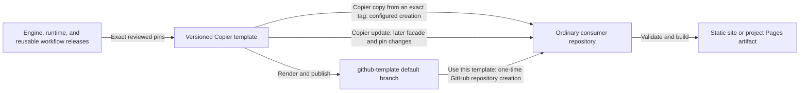

# Orinoco Lite site template

This repository owns the versioned template and update boundary for ordinary, single-repository Orinoco Lite sites.
It supplies a small consumer facade while keeping site content independent from framework releases.

## Position in the stack

| Layer | Owns | Does not own |
| --- | --- | --- |
| [Orinoco Lite engine](https://github.com/con/orinoco-lite-dev) | CLI behavior, the Python wheel, runtime archive, validation and projection behavior, and reusable CI | Copier topology or any site's content |
| This template | Creation, file-ownership classes, pinned release coordinates, update tooling, and the generic consumer documentation facade | Engine internals or organization-specific records and policy |
| Rendered consumer | Canonical records, editorial material, assets, presentation, integrations, extensions, site tests, review, and deployment | Publication of engine or template releases |



The template refers upward through exact engine, runtime, and workflow pins.
It projects downward into a normal consumer repository that can be reviewed, built, and deployed without this maintenance checkout.
See the [checked consumer documentation](github-template/README.md) and the [populated integration consumer](https://github.com/con/test-orinoco-downstream-website) for those lower-level views.

## Rights and intended use

Original template, updater, workflow, and test code is
[MIT licensed](LICENSE). Original documentation is CC BY 4.0. Generated sites
inherit the MIT grant for their generic Orinoco Lite facade, but site owners
must license their own content, media, and presentation separately. See
[`LICENSES.md`](LICENSES.md) and the accepted engine human-review decision
[HR-003](https://github.com/con/orinoco-lite-dev/blob/main/docs/human-review-decisions.md#hr-003--establish-authority-and-a-project-license-matrix).

## Creating a consumer

> **Historical release notice:** immutable tags `v0.1.10` and `v0.1.11`
> retain `v0.1.9` in their embedded Copier answers and lock metadata. Do not
> use those two tags for a new Copier-first site or `copier recopy`.

Use `v0.1.12` or a later internally aligned release for the Copier-first
command below.

Copier-first creation is the preferred path when the site's identity and Pages project path are already known:

```console
copier copy --vcs-ref vX.Y.Z gh:con/orinoco-lite-template new-site
```

Replace `vX.Y.Z` with an exact tag from the [immutable template releases](https://github.com/con/orinoco-lite-template/releases).

For a GitHub-first review, use the repository's **Use this template** action, leave **Include all branches** unchecked, then follow the rendered [GitHub-template bootstrap](github-template/docs/getting-started.md) before adding content.
Both routes retain an exact recorded Copier release and frozen engine environment.

## Repository topology

This repository deliberately has two branch roles:

- `main` contains the authoritative Copier source, release tags, tests, and a checked staging render at `github-template/`; and
- `github-template` contains only that rendered consumer tree at its branch root and is the GitHub repository's default branch.

GitHub's template button copies the default branch, not an arbitrary subdirectory.
The dedicated publication branch is therefore required; the `github-template/` directory on `main` is never exposed as a nested directory to a new consumer.

The default tree contains no organization records, editorial claims, assets,
publication data, inherited site history, or migration evidence.

## Maintainer commands

```console
pixi run render
pixi run check
pixi run publish-github-template-branch
pixi run check-github-template-branch
pixi run release-check
```

`render` replaces the checked default tree from the Copier source and `.github-template-answers.yml`.
It also refreshes `copier-template/pixi.lock` when reviewed release coordinates change, then proves a second rendering leaves that lock byte-identical.
This ships the same frozen environment through two distinct creation mechanisms: Copier renders a configured consumer from an exact tag, while GitHub copies the already rendered publication branch.
`check-render` fails when the checked tree has drifted.
Release the template from a clean commit tagged with a PEP 440 compatible tag such as `v0.1.0`; Copier records that exact tag in each consumer's answers file.
The tag must belong to an immutable GitHub Release.
During every update, the updater resolves the tag to its peeled 40-hex commit both before and after Copier runs and records that commit in the review ledger.

The default answers carry the exact engine, runtime, and workflow coordinates reviewed for the current template release.
Rendering also resolves a frozen cross-platform `pixi.lock`; a publishable update must refresh and verify all of those coordinates together.

`publish-github-template-branch` uses `git subtree split` to publish the exact committed `main:github-template` tree at the root of the local `github-template` branch.
It does not push or change GitHub settings.
`release-check` is the post-publication gate and therefore requires that local branch to exist already.

See the [ownership contract](docs/ownership.md), [release procedure](docs/releasing.md), [publication topology](docs/publishing.md), and [test contract](docs/testing.md).
